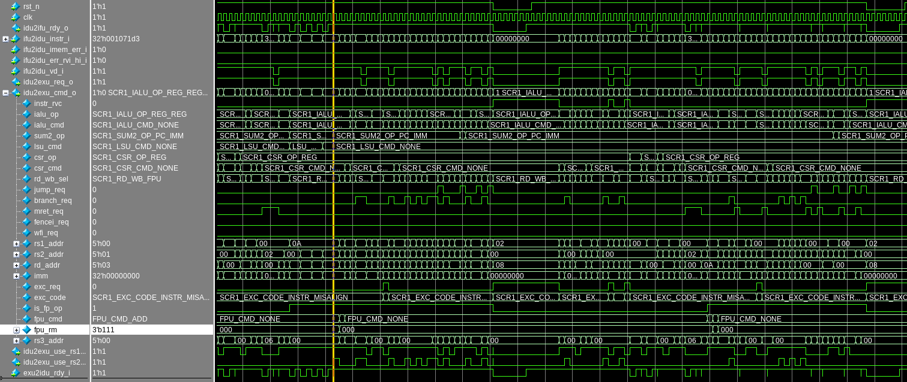
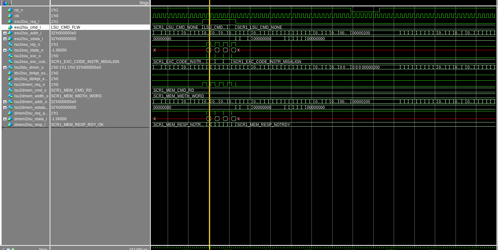
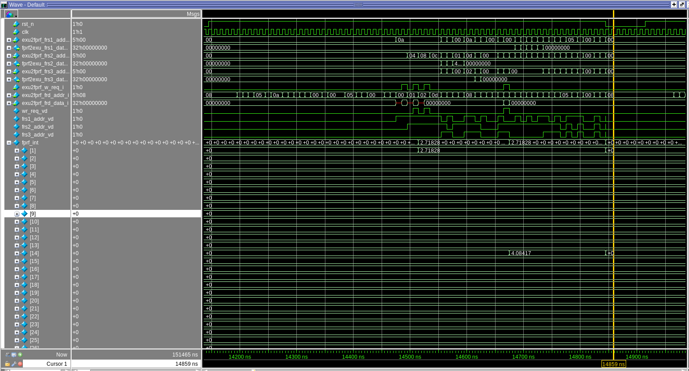
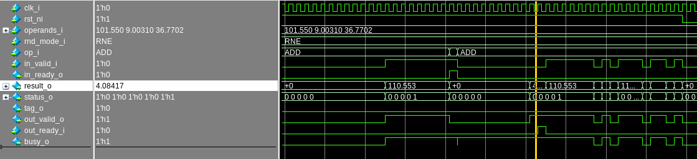

# Модификация модулей для поддержки F расширения

# Модуль декодера
В модуль декодера была добавлена определние использования регистра frs3, распознование команд для F расширения.

# Модуль статусного регистра

# Модуль загрузки/выгрузки
Для доработки модуля загрузки выгрузки необходмо только добавить название

# Модуль регистрвого файла для чисел с плавающей запятой
В модуль декодера была добавлена определние использования регистра frs3, распознование команд для F расширения.

# Модуль исполнителя

# Модуль ФПУ

